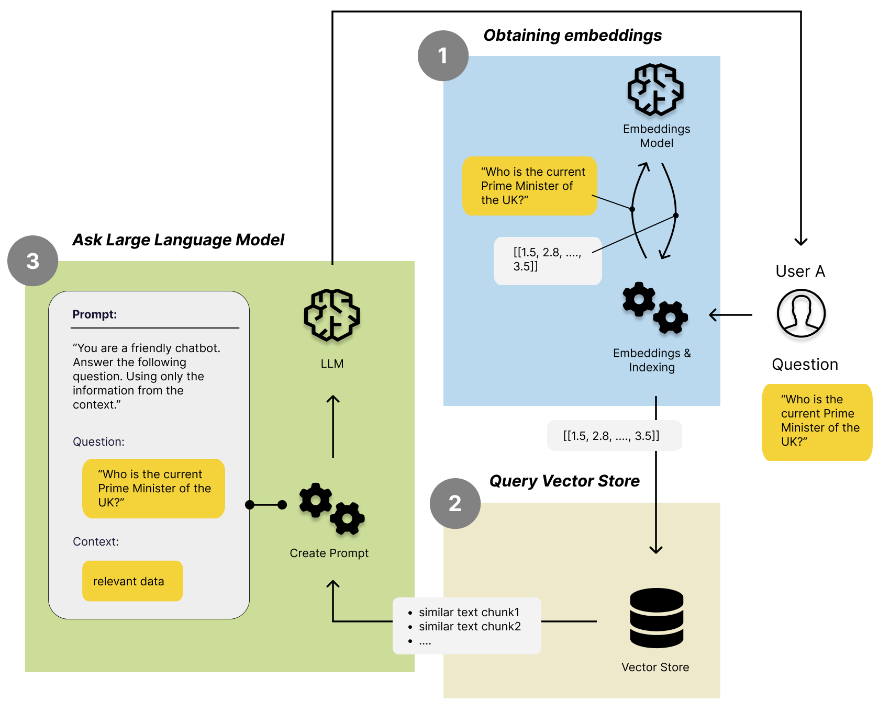

# Tutorial to Text Embeddings and Vector Databases

Source code to the Medium blog post "All You Need to Know about Vector Databases and How to Use Them to Augment Your LLM Apps":

https://medium.com/towards-data-science/all-you-need-to-know-about-vector-databases-and-how-to-use-them-to-augment-your-llm-apps-596f39adfedb

## Built With

* Pandas, Numpy, Scikit-learn, Matplotlib 
* all-MiniLM-L6-v2 (Sentence Transformer Model - via HuggingFace)
* Chroma (Vector Database)

## License
[MIT](https://choosealicense.com/licenses/mit/)